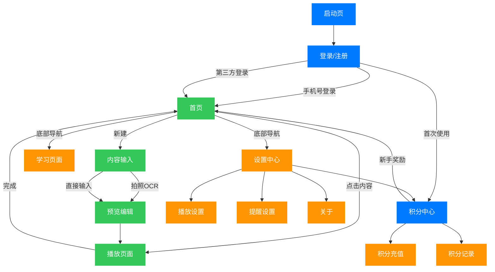
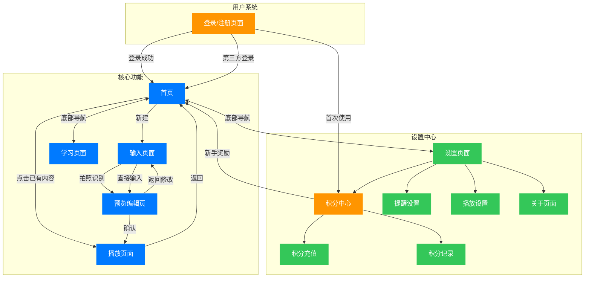

# 忆刻 - 智能记忆辅助应用 PRD文档

版本：v1.0.0 (MVP)
更新日期：2025-03-14
状态：开发中

## 功能流程图

## 页面流程图

## 1. 产品概述

### 1.1 产品定位
忆刻是一款基于科学记忆方法的智能背诵辅助工具，专注于帮助用户通过听觉重复和智能提醒来提升记忆效率。

### 1.2 目标用户群
- 主要用户：需要背诵古诗文的初中生
- 次要用户：高中生、语言学习者
- 潜在用户：需要记忆专业知识的大学生

### 1.3 用户痛点
1. 传统硬背方式费时费力，缺乏趣味性
2. 缺乏科学的复习提醒机制
3. 单一的记忆方式导致遗忘快
4. 学生群体的消费能力有限

## 2. 功能需求（MVP版本）

### 2.1 用户系统
#### 2.1.1 基础账户功能
- 优先级：P0
- 功能描述：
  * 手机号注册/登录
  * 数据云端同步
  * 退出登录
- 技术要求：
  * 登录响应时间≤1秒
  * 数据同步成功率≥99.9%

#### 2.1.2 积分系统
- 优先级：P0
- 功能描述：
  * 新用户注册赠送100积分
  * 积分充值功能（4个档位：100/300/600/1000积分）
  * 积分消费记录
  * 积分余额查询
- 价格方案：
  * 100积分：¥3（基础套餐）
  * 300积分：¥8（推荐套餐）
  * 600积分：¥15（限时特惠）
  * 1000积分：¥20（超值套餐）
- 使用规则：
  * 拍照OCR识别：免费
  * 日常对话：免费
  * 在线语音：5积分/次
  * 试听功能：免费
  * 积分永久有效
- 安全要求：
  * 积分交易加密
  * 支付安全保障（Apple支付）
  * 账户余额实时同步

### 2.2 内容输入模块
#### 2.2.1 基础输入功能
- 优先级：P0
- 功能描述：
  * 拍照OCR文本识别
  * 手动文本输入（限制250字）
  * 内容分段预览与编辑
  * 内容编辑功能（支持修改已保存内容）
  * 内容删除功能（长按或右滑触发）
- 技术要求：
  * OCR识别准确率≥95%
  * 响应时间≤1秒
  * 删除操作需二次确认
  * 编辑后自动清理相关缓存

### 2.3 音频播放模块
#### 2.3.1 核心播放功能
- 优先级：P0
- 功能描述：
  * 文本转语音（中文）
  * 播放控制（播放/暂停/上一条/下一条）
  * 播放速度调节（0.5x-2.0x）
  * 自定义间隔时间
  * 预设音色选择（标准、轻柔、浑厚）
  * 语音试听功能
  * 内容切换导航（支持在播放页面直接切换不同记忆内容）
  * 编辑功能（优化后的编辑按钮设计）
- 技术要求：
  * 语音清晰自然
  * 操作响应时间≤0.1秒
  * 不同音色有明显辨识度
  * 内容切换流畅无卡顿

### 2.4 学习模块
#### 2.4.1 学习页面
- 优先级：P0
- 功能描述：
  * 学习进度概览（今日学习时间、待复习数量等）
  * 最近在学内容
  * 待复习内容列表
  * 学习统计数据可视化
- 技术要求：
  * 数据更新及时准确

### 2.5 记忆提醒系统
#### 2.5.1 基础提醒
- 优先级：P0
- 功能描述：
  * 基于艾宾浩斯遗忘曲线的复习提醒
  * 可开关提醒功能
  * 免打扰时间设置
- 技术要求：
  * 提醒准确到达
  * 支持本地推送

## 3. 界面设计（MVP版本）

### 3.1 核心界面
1. 登录/注册页
   - 手机号输入框
   - 验证码输入框
   - 用户协议与隐私政策

2. 积分中心页
   - 当前积分余额展示
   - 今日/本月消耗统计
   - 充值入口（大按钮）
   - 消费记录入口
   - 积分使用说明
   - 温馨提示说明

3. 积分充值页
   - 四个充值套餐选项
   - 默认选中300积分套餐
   - 限时特惠标记（600积分）
   - Apple支付按钮
   - 支付安全提示

4. 积分记录页
   - 收支记录列表
   - 按月份分组展示
   - 收支类型筛选
   - 交易详情展示

5. 首页
   - 新建内容按钮
   - 内容列表（待复习/已完成）
   - 长按/右滑显示删除选项
   - 删除确认弹窗
   - 底部导航栏（首页/学习/设置）

6. 学习页面
   - 学习进度概览
   - 最近在学内容
   - 待复习内容
   - 学习统计图表

7. 输入页
   - 拍照识别按钮
   - 文本输入框
   - 文字计数器（250字限制）
   - 积分消耗提示

8. 预览编辑页
   - 分段内容列表
   - 编辑功能
   - 开始背诵按钮
   - 返回修改选项

9. 播放页
   - 大字号文本显示
   - 播放速度控制（0.5x-2.0x）
   - 间隔时间调节
   - 播放控制面板（播放/暂停/上一条/下一条）
   - 优化设计的编辑按钮（圆形背景+图标）
   - 内容切换导航控制
   - 播放状态实时反馈

10. 设置页
    - 积分中心入口
    - 提醒设置入口
    - 播放设置入口
    - 关于页面入口

11. 播放设置页
    - 预设音色选择（标准/轻柔/浑厚）
    - 试听效果按钮
    - 默认间隔时间设置
    - 播放速度默认值
    - 音色效果说明

12. 提醒设置页
    - 提醒开关
    - 提醒时间点设置
    - 免打扰时间设置
    - 基于艾宾浩斯曲线的提醒间隔

13. 关于页面
    - 应用版本信息
    - 功能介绍
    - 用户协议/隐私政策入口
    - 联系方式

### 3.2 交互规范
| 功能 | 交互方式 | 响应时间 |
|------|----------|----------|
| 登录 | 点击登录按钮 | ≤1秒 |
| API验证 | 点击验证按钮 | ≤1秒 |
| 拍照 | 单击拍照按钮 | ≤0.3秒 |
| 播放 | 单击播放/暂停 | ≤0.1秒 |
| 间隔调节 | 滑动调节器 | 实时响应 |
| 内容删除 | 长按/右滑 | ≤0.2秒 |
| 底部导航 | 单击切换 | ≤0.1秒 |
| 试听效果 | 单击试听按钮 | ≤0.1秒 |

### 3.3 视觉规范

1. **色彩系统**
   - 主色：#007AFF（按钮、链接、导航栏）
   - 成功色：#34C759（状态、开关）
   - 警示色：#FF9500（限时特惠、提醒）
   - 背景色：#F5F5F7（页面背景）
   - 卡片背景：#FFFFFF（白色）
   - 文字颜色：#1D1D1F（主要）/#8E8E93（次要）

2. **间距规范**
   - 页面边距：20px
   - 卡片内边距：16px/20px
   - 元素间距：12px/24px
   - 文本行高：1.5
   - 导航栏高度：44px

3. **组件规范**
   - 圆角：20px（页面卡片）/16px（内部卡片）/12px（按钮）
   - 阴影：0 4px 6px rgba(0, 0, 0, 0.1)
   - 图标：24x24px（导航）/20x20px（功能）
   - 文字：24px（大标题）/16px（正文）/14px（副文本）/12px（提示）
   - 按钮高度：44px（主按钮）/36px（次按钮）

## 4. 技术要求（MVP版本）

### 4.1 基础要求
- iOS 13.0+
- 离线运行核心功能
- 本地数据存储
- 云端数据同步
- 现代化导航系统（支持iOS 16新特性，同时保持向后兼容性）

### 4.2 性能指标
- 应用大小≤30MB
- 启动时间≤2秒
- 内存占用≤50MB
- 数据同步延迟≤3秒
- 导航过渡动画流畅度≥60fps

### 4.3 安全要求
- 用户数据加密存储
- 支付安全保障
- 积分交易加密
- 账号安全保障

### 4.4 稳定性
- 崩溃率≤0.1%
- OCR识别成功率≥95%
- 后台播放稳定性≥99.9%
- 同步成功率≥99.9%

## 6. 风险评估（MVP版本）

### 6.1 技术风险
- OCR识别准确率不足
- 后台播放可能被系统限制
- 本地通知可能被用户禁用
- 支付系统安全风险

### 6.2 产品风险
- 用户习惯养成难度
- 提醒频率把控
- 音频播放体验
- 积分定价合理性（已优化，目前采用学生友好的价格策略）

### 6.3 应对策略
1. 技术风险应对
   - OCR失败时提供手动编辑功能
   - 提供播放状态提示
   - 引导用户开启通知权限
   - 采用Apple支付保障支付安全

2. 产品风险应对
   - 简化首次使用流程
   - 提供默认推荐的提醒时间
   - 支持音频试听功能
   - 积分消耗预警提醒
   - 新用户赠送100积分，降低试用门槛
   - 采用学生友好的价格策略

## 7. MVP版本成功指标

### 7.1 核心指标
- 每日活跃用户≥1000
- 单次使用时长≥5分钟
- 3日留存率≥30%
- 付费转化率≥3%（考虑到学生群体特点，调整为更合理的目标）

### 7.2 功能指标
- OCR识别成功率≥95%
- 播放完成率≥80%
- 提醒点击率≥40%
- 充值成功率≥99%
- 音色辨识度满意度≥85%

### 7.3 质量指标
- 应用崩溃率≤0.1%
- 用户反馈评分≥4.0
- 核心功能使用率≥70%
- 支付响应时间≤1秒

## 8. 更新日志

### v1.0.0 (MVP) - 2025-03-xx
- 初始版本发布
- 实现核心功能：
  * 用户系统（手机号/微信/苹果登录）
  * 积分系统（充值/消费/记录）
  * 文本输入和播放控制
  * 学习统计与记忆提醒
  * 设置中心
  * 语音试听功能
  * 现代化导航系统（支持iOS 16新特性，同时保持向后兼容性）
- 确保核心功能稳定性

### v1.0.1 - 2025-03-14
- 优化播放功能：
  * 重构PlayerView，采用MVVM架构
  * 拆分UI组件，提高代码可维护性
  * 优化播放控制逻辑
- 升级导航系统：
  * 支持iOS 16新特性（NavigationStack、navigationDestination）
  * 保持iOS 13-15向后兼容性
  * 优化导航体验和过渡动画
  * 集中管理导航逻辑，提高代码可维护性 